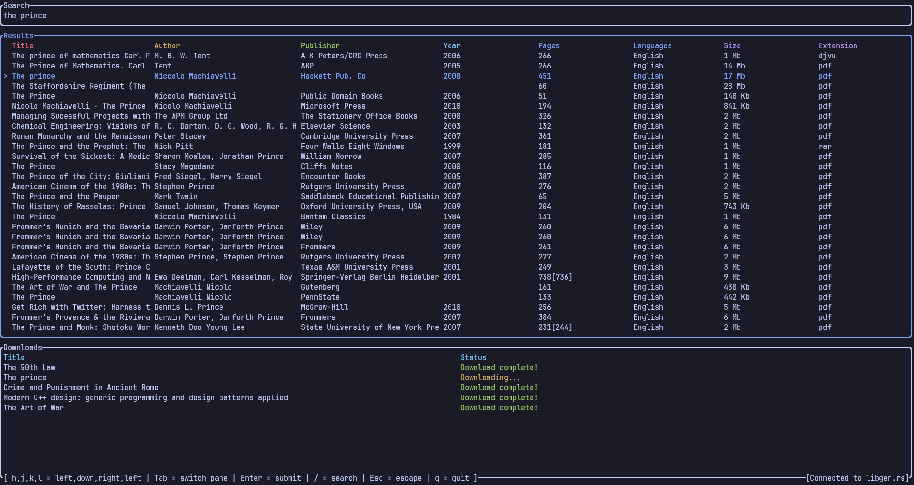

# Libgen TUI - Download books over the terminal


## Features
- asynchronous downloads allowing multiple books at the same time
- configurable download directory

## Installation
1. `git clone https://github.com/Houdiee/libgen-tui`
2. `cd libgen-tui`
3. `cargo build --release`
4. `cp target/release/libgen-tui ~/.local/bin/`
5. ensure that `~/.local/bin/` is in your system path and you can now run `libgen-tui`

### NixOS users
If you are struggling to build on nixos, run `nix-shell` within the project directory first, before running `cargo build --release`.

## Configuration
By default, running `libgen-tui` will create a configuration file at `$XDG_CONFIG_HOME/libgen-tui/config.toml` if there isn't one. Below is the defaut configuration:
```toml
mirrors = ["libgen.is", "libgen.rs"] # Feel free to remove or add mirrors if searching isn't working properly
download_directory = "/home/{user}/libgen-tui" # The default download path, where all books will be downloaded to 
max_results = 50 # How many results to display. Accepted values are 25, 50 or 100
```
