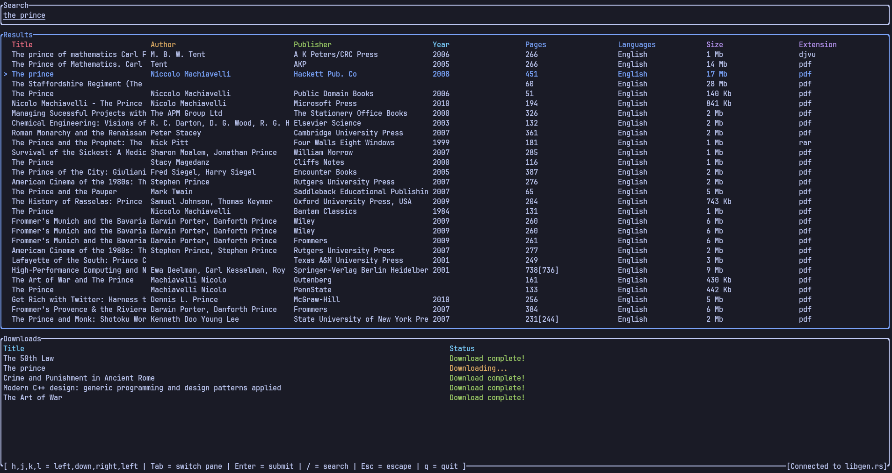

# Libgen TUI - Download books over the terminal


Download any book over the internet through the terminal, quick and easy. Without dealing with annoying popups, ads, navigation, etc.

## Features
- asynchronous downloads allowing multiple books at the same time
- configurable download directory
- automatic failover between mirrors when one stops responding

## Installation

### Prebuilt binaries
Grab the archive for your platform from the [latest release](https://github.com/Houdiee/libgen-tui/releases/latest). Each one holds the binary, the README and the LICENSE, and is published next to a matching `.sha256` file.

| Platform | Asset |
| --- | --- |
| Linux (x86_64) | `libgen-tui-<version>-x86_64-unknown-linux-gnu.tar.gz` |
| macOS (Intel and Apple Silicon) | `libgen-tui-<version>-universal-apple-darwin.tar.gz` |
| Windows (x86_64) | `libgen-tui-<version>-x86_64-pc-windows-msvc.zip` |

#### Linux
```sh
tar -xzf libgen-tui-*-x86_64-unknown-linux-gnu.tar.gz
cd libgen-tui-*-x86_64-unknown-linux-gnu
install -Dm755 libgen-tui ~/.local/bin/libgen-tui
```
Make sure `~/.local/bin` is on your `$PATH`, or use `sudo install -m755 libgen-tui /usr/local/bin/` instead.

#### macOS
```sh
tar -xzf libgen-tui-*-apple-darwin.tar.gz
cd libgen-tui-*-apple-darwin
mkdir -p ~/.local/bin && install -m755 libgen-tui ~/.local/bin/
```
Make sure `~/.local/bin` is on your `$PATH`, or use `sudo install -m755 libgen-tui /usr/local/bin/` to install it for every user instead.

The binaries are not signed, so macOS quarantines anything downloaded from a browser. If you get *"cannot be opened because the developer cannot be verified"*, clear the flag:
```sh
xattr -d com.apple.quarantine ~/.local/bin/libgen-tui
```

#### Windows
Extract the `.zip` and run `libgen-tui.exe`. There is nothing to install.

The binary is not code-signed, so Windows shows a *"Windows protected your PC"* screen the first time. Click **More info**, then **Run anyway**.

Use Windows Terminal rather than the legacy console host, which renders the interface poorly.

Optionally, to launch it as `libgen-tui` from any terminal, move it somewhere permanent and add that folder to your `PATH` in PowerShell:
```powershell
$dest = "$env:LOCALAPPDATA\Programs\libgen-tui"
New-Item -ItemType Directory -Force -Path $dest
Move-Item .\libgen-tui-*-x86_64-pc-windows-msvc\libgen-tui.exe $dest
[Environment]::SetEnvironmentVariable("Path", "$([Environment]::GetEnvironmentVariable('Path','User'));$dest", "User")
```
Reopen your terminal afterwards.

### From source
Needs a [Rust toolchain](https://rustup.rs). There is no OpenSSL or other system dependency to install first.
```sh
cargo install --git https://github.com/Houdiee/libgen-tui
```
This drops the binary in `~/.cargo/bin`. To build a checkout instead:
```sh
git clone https://github.com/Houdiee/libgen-tui
cd libgen-tui
cargo build --release
```
The binary is then at `target/release/libgen-tui`; copy it somewhere on your `PATH`.

### NixOS users
If you are struggling to build on nixos, run `nix-shell` within the project directory first, before running `cargo build --release`.

## Configuration
On first run `libgen-tui` writes a configuration file if there isn't one already:

| Platform | Config file | Default download directory |
| --- | --- | --- |
| Linux | `$XDG_CONFIG_HOME/libgen-tui/config.toml` (usually `~/.config/...`) | `~/libgen-tui` |
| macOS | `~/Library/Application Support/libgen-tui/config.toml` | `~/libgen-tui` |
| Windows | `%APPDATA%\libgen-tui\config.toml` | `C:\Users\<you>\libgen-tui` |

Below is the default configuration:
```toml
additional_mirrors = [] # Extra libgen domains to try alongside the built-in ones
download_directory = "/home/{user}/libgen-tui" # The default download path, where all books will be downloaded to 
max_results = 50 # How many results to display. Accepted values are 25, 50 or 100
```

On Windows, write paths with either forward slashes or escaped backslashes, since TOML treats a single backslash as an escape: `download_directory = "C:/Users/you/Books"`.

### Mirrors
The libgen domains are built into the binary rather than the config file, because they die and get replaced over time and a config written once would go stale forever. On startup every domain is tried in parallel and the first to answer wins, then the rest of the current family is read off that page — so newly added domains are picked up without updating anything.

Use `additional_mirrors` to add domains of your own, for instance if the built-in ones are blocked where you are. They are raced alongside the built-in list, not used only as a last resort. A domain that answers but does not serve libgen search results is skipped automatically.

Older versions kept a `mirrors` list in this file. That key is now ignored, so an old config picks up the current domains on its own.

## Troubleshooting
Libgen changes its domains and page layout from time to time, which breaks searching or downloading. To find out which stage broke, run the live tests:
```sh
cargo test
```
They check mirror reachability, result parsing, download-link resolution and an actual download, and report which one fails.

Run with `RUST_LOG=debug libgen-tui 2>log.txt` to record what each request did. Logging is off by default because it writes to stderr, which would otherwise draw over the interface.
